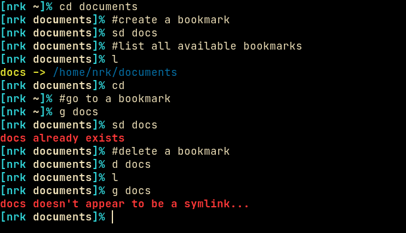

# Shellmarks

A simple shell script for managing bookmarks via symlinks.



Shellmarks is heavily inspired by [bashmarks](https://github.com/huyng/bashmarks). Unlike bashmarks however, shellmarks uses symlinks to create and manage bookmarks.

This is good because now you can point many different application, such as your filemanger or the filepicker etc, to a single unified directory. You no longer need to maintain different bookmarks for different applications.


## Installation

Cone the repo.

```
git clone https://codeberg.org/NRK/shellmarks.git
```

Then just copy/move `shellmarks` into your $PATH. `chmod +x` it if needed.
Instead of copying, you can also create a symlink. This way you can do a git pull to get updates.

## Usage

By default shellmarks uses `~/.local/share/shellmarks` as the bookmark directory. This can be changed via the `$SH_MARKS` environment variable.


Add a bookmark. If [target] is omitted the current working directory `$PWD`, will be used.
```
shellmarks add <name> [target]
```

List all the available bookmarks. When called with the `-n` flag, it will only print the bookmark name without printing the realpath.
```
shellmarks ls [-n]
```

Remove a bookmark.
```
shellmarks rm <name>
```

Print the real path of a bookmark.
```
shellmarks path <name>
```

All of these commands are meant to be aliased. In the example image above I'm using the following aliases. Copy paste them into your `~/.bashrc` or `~/.zshrc`.

```
alias l="shellmarks ls"
alias d="shellmarks rm"
alias sd="shellmarks add"
```

You can also disable the colored output by calling shellmarks with the `-c` flag.

### Cd-ing into a directory

Since shellmarks simply creates symlinks, there's a couple ways to actually achieve this. My preferred way is to adding a small function wrapper to your shell.

Add the following function into your `~/.bashrc` or `~/.zshrc`.

```
g() {
  cddir="$(shellmarks path "$1")";
  if [ $? -eq 0 ]; then
    cd "$cddir"
  else
    printf '%s' "$cddir"
  fi
}
```

Now you can do `g <name>` to cd into a directory form the command line. You are free to change `g` to something else here if you wish.

Another way would be to utilize the [$CDPATH](https://linux.101hacks.com/cd-command/cdpath/) environment variable. Do be careful to not modify this variable outside your interactive shell, as that might lead to undesirable side-effects.

## Auto Complete

### ZSH

Add the following to your `.zshrc` to get auto-completion.

```
_shmk_autocomp() { reply=($(shellmarks -c ls -n)); }
compctl -K _shmk_autocomp shellmarks
compctl -K _shmk_autocomp g  # for the cd function, change 'g' if your function is named differently
```

### Bash

Add the following to your `.bashrc` to get auto-completion.

```
bind 'set show-all-if-ambiguous on'  # optional, but good to have
_shmk_autocomp() {
  local curw
  COMPREPLY=()
  curw=${COMP_WORDS[COMP_CWORD]}
  COMPREPLY=($(compgen -W '`shellmarks -c ls -n`' -- $curw))
  return 0
}

complete -F _shmk_autocomp g  # for the cd function, change 'g' if your function is named differently
complete -F _shmk_autocomp d  # for the d alias, change it to fit your alias
```
